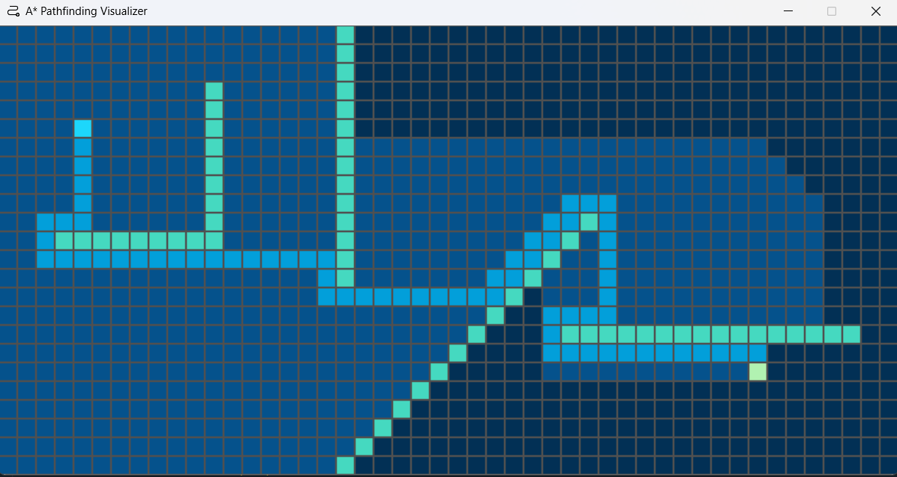

# A* Pathfinding Visualizer

The A* Pathfinding Visualizer models a script's line of thinking using an A* Pathfinding algorithm to find the shortest path from one start node to an end node through a user-made maze

## Table of Contents
- [Controls](https://github.com/hammadfarooqi/Astar-Pathfinding-Visualizer/#Controls)
- [Technologies](https://github.com/hammadfarooqi/Astar-Pathfinding-Visualizer/#technologies)
- [Setup](https://github.com/hammadfarooqi/Astar-Pathfinding-Visualizer/#setup)
- [Authors](https://github.com/hammadfarooqi/Astar-Pathfinding-Visualizer/#authors)

## Controls

- **Text Display:** A scrollable display for the article content that is parsed and autoseparated into sections is displayed on the left.
- **Quiz Display:** One multiple choice question chosen from the article's question bank is displayed on the right, and after the user answers, they are provided instant audio and visual feedback and a new question.
- **Formative Assessment:** As the user progresses through the multiple choice questions, Interactpedia uses its built-in algorithm to choose questions for the user about topics they struggle with.
- **Cognitive Scaffolding Hints:** If the reader are stuck on one question, they can click the hint button that points them to where they can find the answer.

## Technologies
 - Python 
 - Pygame 